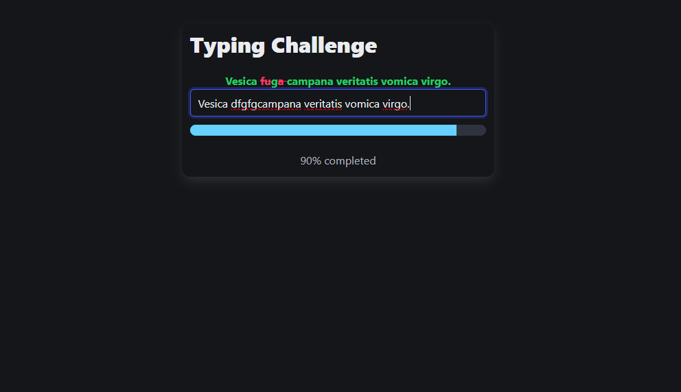

# ⌨️ Type Challenge

A simple **Typing Challenge App** built with Angular.  
Users type a randomly generated sentence (using `@faker-js/faker`) and get instant feedback with colored letters, progress tracking, and a success message when they complete the challenge.

---

## 🚀 Features
- ✅ Random text generation with `@faker-js/faker`  
- ✅ Real-time typing feedback (correct / incorrect / pending)  
- ✅ Progress bar to track typing completion  
- ✅ Success animation when typing is completed  
- ✅ Clean UI with [Bulma](https://bulma.io/)  

---

## 📸 Screenshot
> Replace the image below with an actual screenshot of the app.



---

## 🛠️ Installation & Setup

1. Clone the repository:
   ```bash
   git clone https://github.com/AliDiiv/Type-Challenge.git
   cd Type-Challenge

2. Install dependencies:
   ```bash
   npm install

 3. Run the development server:
   ```bash
   ng serve
 

